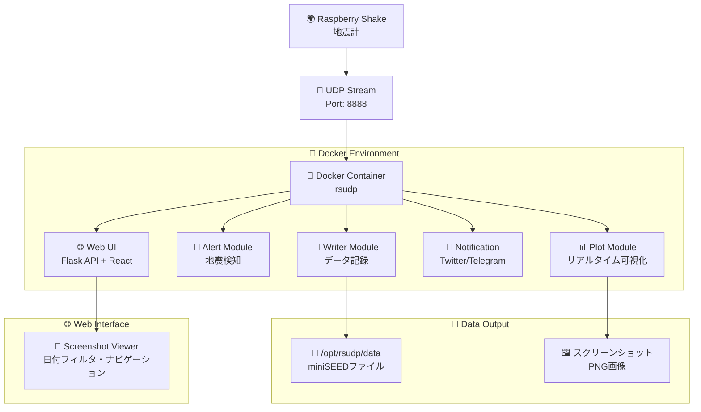

# 🌏 rsudp Docker

Raspberry Shake の地震データをリアルタイムで監視・解析するための Docker 環境

## 📑 目次

- [📋 概要](#-概要)
    - [主な特徴](#主な特徴)
- [🖼️ スクリーンショット](#️-スクリーンショット)
- [🏗️ システム構成](#️-システム構成)
- [🚀 セットアップ](#-セットアップ)
    - [必要な環境](#必要な環境)
    - [1. プロジェクトのクローン](#1-プロジェクトのクローン)
    - [2. Dockerイメージのビルド](#2-dockerイメージのビルド)
- [💻 実行方法](#-実行方法)
    - [Docker コンテナでの起動](#docker-コンテナでの起動)
    - [設定の変更](#設定の変更)
- [📊 データ出力](#-データ出力)
- [🔧 カスタマイズ](#-カスタマイズ)
    - [設定ファイルの変更](#設定ファイルの変更)
    - [パッチファイルについて](#パッチファイルについて)
- [📝 ライセンス](#-ライセンス)

## 📋 概要

このプロジェクトは [rsudp](https://github.com/raspishake/rsudp) を Docker コンテナで動作させるための設定です。Raspberry Shake からのリアルタイムデータストリームを受信し、地震イベントの検出・記録・可視化を行います。

### 主な特徴

- 🐋 **Docker対応** - 環境構築不要の簡単セットアップ
- 🌍 **ヘッドレス対応** - GUI環境なしでの動作をサポート
- 📈 **リアルタイム監視** - 地震データのライブ表示・記録
- 🔔 **アラート機能** - 地震検知時の自動通知
- 💾 **データ記録** - miniSEED形式でのデータ保存
- 📱 **SNS連携** - Twitter/Telegram通知対応
- 🖼️ **Web画像ビューワー** - React製のスクリーンショット閲覧インターface

## 🖼️ スクリーンショット


_Raspberry Shake 4Dで記録された地震波形の例_

## 🏗️ システム構成



## 🚀 セットアップ

### 必要な環境

- Docker
- Raspberry Shake（設定済み・ネットワーク接続済み）
- UDP データストリームの設定

### 1. プロジェクトのクローン

```bash
git clone <このリポジトリのURL>
cd rsudp
```

### 2. Dockerイメージのビルド

```bash
docker build -t rsudp .
```

## 💻 実行方法

### Docker コンテナでの起動

```bash
# フォアグラウンドで実行
docker run --rm -p 8888:8888/udp -v $(pwd)/data:/opt/rsudp/data rsudp

# Web UIポートも公開してバックグラウンドで実行
docker run -d --name rsudp-monitor -p 8888:8888/udp -p 5000:5000 -v $(pwd)/data:/opt/rsudp/data rsudp

# ログの確認
docker logs -f rsudp-monitor

# コンテナの停止
docker stop rsudp-monitor
```

### 設定の変更

デフォルトの設定は以下の通りです：

- **Station**: R503C
- **Output Directory**: `/opt/rsudp/data`
- **Write**: 有効（miniSEED形式でデータ保存）
- **Plot Screenshots**: 有効（地震検知時のスクリーンショット保存）

カスタム設定で実行する場合：

```bash
# 設定ファイルをマウントして実行（Web UIポート含む）
docker run --rm -p 8888:8888/udp -p 5000:5000 \
  -v $(pwd)/data:/opt/rsudp/data \
  -v $(pwd)/custom_settings.json:/root/.config/rsudp/rsudp_settings.json \
  rsudp
```

## 📊 データ出力

### 出力ファイル

- **miniSEEDファイル**: `./data/` ディレクトリに保存
- **スクリーンショット**: 地震検知時に `./data/` に PNG 形式で保存
- **ログファイル**: コンテナログとして出力

### Web画像ビューワー

スクリーンショットをブラウザで閲覧できるWebインターフェースが利用可能です：

- **アクセス**: `http://localhost:5000/rsudp` （コンテナ起動時にポート5000を公開）
- **機能**:
    - 年/月/日による階層的日付フィルタリング
    - ファイル名パース（PREFIX-YYYY-MM-DD-HHMMSS.png形式）
    - 相対時間表示（「1日前」等）
    - 矢印キーによるナビゲーション
    - レスポンシブデザイン（PC・モバイル対応）
- **技術**: React + TypeScript + Bulma CSS + Flask API

### ファイル名の形式

```
# miniSEEDファイル
AM_R503C_00_EHZ.ms  # Z軸（垂直）成分
AM_R503C_00_EHE.ms  # E軸（東西）成分
AM_R503C_00_EHN.ms  # N軸（南北）成分

# スクリーンショット（Web画像ビューワー対応形式）
SHAKE-2025-08-15-104524.png  # PREFIX-YYYY-MM-DD-HHMMSS.png
ALERT-2025-08-14-091523.png  # イベントタイプ別プレフィックス
```

## 🔧 カスタマイズ

### 設定ファイルの変更

Dockerfileの以下の部分で設定をカスタマイズできます：

```dockerfile
RUN jq '.settings.station = "R503C" | .settings.output_dir = "/opt/rsudp/data" | .write.enabled = true | .plot.eq_screenshots = true' \
    /root/.config/rsudp/rsudp_settings.json > /tmp/rsudp_settings.json \
 && mv /tmp/rsudp_settings.json /root/.config/rsudp/rsudp_settings.json
```

主要な設定項目：

- `station`: ステーション名
- `output_dir`: データ出力ディレクトリ
- `write.enabled`: データ記録の有効/無効
- `plot.eq_screenshots`: スクリーンショット保存の有効/無効

### パッチファイルについて

`c_plots.diff` は rsudp をヘッドレス環境（DISPLAY環境変数なし）で動作させるためのパッチです。このパッチにより：

- GUI環境がない場合は自動的に `Agg` バックエンドを使用
- アイコン設定処理をヘッドレス環境ではスキップ
- エラーを発生させることなく可視化機能を利用可能

## 📝 ライセンス

このプロジェクトは Apache License Version 2.0 のもとで公開されています。

オリジナルの rsudp についての詳細は [公式ドキュメント](https://raspishake.github.io/rsudp/) をご確認ください。

---

<div align="center">

**⭐ このプロジェクトが役に立った場合は、Star をお願いします！**

[🐛 Issue 報告](../../issues) | [💡 Feature Request](../../issues/new) | [📖 rsudp 公式ドキュメント](https://raspishake.github.io/rsudp/)

</div>
