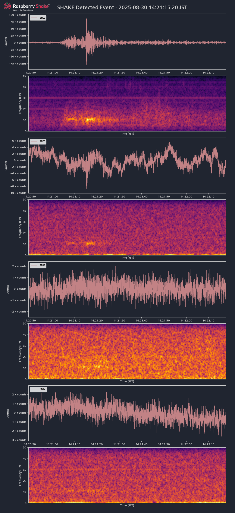

# 🌏 rsudp Docker

Raspberry Shake の地震データをリアルタイムで監視・解析するための Docker 環境

## 📑 目次

- [📋 概要](#-概要)
    - [主な特徴](#主な特徴)
    - [🌐 動作サンプル](#-動作サンプル)
- [🖼️ スクリーンショット](#️-スクリーンショット)
- [🏗️ システム構成](#️-システム構成)
- [🚀 セットアップ](#-セットアップ)
    - [必要な環境](#必要な環境)
    - [1. プロジェクトのクローン](#1-プロジェクトのクローン)
    - [2. Dockerイメージのビルド](#2-dockerイメージのビルド)
- [💻 実行方法](#-実行方法)
    - [Docker コンテナでの起動](#docker-コンテナでの起動)
    - [設定の変更](#設定の変更)
- [📊 データ出力](#-データ出力)
- [🔧 カスタマイズ](#-カスタマイズ)
    - [設定ファイルの変更](#設定ファイルの変更)
    - [パッチファイルについて](#パッチファイルについて)
- [📝 ライセンス](#-ライセンス)

## 📋 概要

このプロジェクトは [rsudp](https://github.com/raspishake/rsudp) を Docker コンテナで動作させるための設定です。

### 主な特徴

- 🐋 **Docker対応** - 環境構築不要の簡単セットアップ
- 🌍 **ヘッドレス対応** - GUI環境なしでの動作をサポート
- 🖼️ **Web画像ビューワー** - React製のスクリーンショット閲覧インターface
- ❤️ **ヘルスチェック対応** - アプリケーション稼働状況の監視機能
- 🕘 **JST時刻表示** - 日本標準時での地震データ表示・記録
- 🎛️ **最大振幅フィルタリング** - 地震波形の最大振幅値による絞り込み機能

### 🌐 動作サンプル

実際の動作は以下のリンクで確認できます：
**[Web画像ビューワーのデモ](https://rsudp-webui.kubernetes.green-rabbit.net/rsudp/)**

## 🖼️ スクリーンショット



_Raspberry Shake 4Dで記録された地震波形の例_

## 🏗️ システム構成


## 🚀 セットアップ

### 必要な環境

- Docker
- Raspberry Shake（設定済み・ネットワーク接続済み）
- UDP データストリームの設定

### 1. プロジェクトのクローン

```bash
git clone <このリポジトリのURL>
cd rsudp
```

### 2. Dockerイメージのビルド

```bash
docker build -t rsudp .
```

## 💻 実行方法

### Docker コンテナでの起動

```bash
# フォアグラウンドで実行
docker run --rm -p 8888:8888/udp -v $(pwd)/data:/opt/rsudp/data rsudp

# Web UIポートも公開してバックグラウンドで実行
docker run -d --name rsudp-monitor -p 8888:8888/udp -p 5000:5000 -v $(pwd)/data:/opt/rsudp/data rsudp

# ログの確認
docker logs -f rsudp-monitor

# コンテナの停止
docker stop rsudp-monitor
```

### 設定の変更

デフォルトの設定は以下の通りです：

- **Station**: Shake
- **Output Directory**: `/opt/rsudp/data`
- **Write**: 有効（地震データ保存）
- **Plot Screenshots**: 有効（地震検知時のスクリーンショット保存）

カスタム設定で実行する場合：

```bash
# 設定ファイルをマウントして実行（Web UIポート含む）
docker run --rm -p 8888:8888/udp -p 5000:5000 \
  -v $(pwd)/data:/opt/rsudp/data \
  -v $(pwd)/custom_settings.json:/root/.config/rsudp/rsudp_settings.json \
  rsudp
```

## 📊 データ出力

### 出力ファイル

- **スクリーンショット**: 地震検知時に `./data/` に PNG 形式で保存
- **ログファイル**: コンテナログとして出力

### Web画像ビューワー

スクリーンショットをブラウザで閲覧できるWebインターフェースが利用可能です：

- **アクセス**: `http://localhost:5000/rsudp` （コンテナ起動時にポート5000を公開）
- **フィルタ機能**:
    - **最大振幅フィルタ**: 地震波形の最大振幅値（MaxCount）による絞り込み
    - **日付フィルタ**: 年/月/日による階層的絞り込み
    - **リアルタイム統計**: 全体とフィルタ後のスクリーンショット数を表示
- **表示機能**:
    - ファイル名パース（PREFIX-YYYY-MM-DD-HHMMSS.png形式）
    - **JST時刻表示**：すべての時刻情報を日本標準時で表示
    - 相対時間表示（「1日前」等）
    - **地震検知情報表示**: 最大振幅値、STA値、STA/LTA比率の詳細表示
    - **PNGメタデータ活用**: 画像のDescriptionフィールドからMaxCount等を自動抽出
- **操作性**:
    - 矢印キーによるナビゲーション
    - スワイプ操作（モバイル）
    - 全画面表示対応
    - レスポンシブデザイン（PC・モバイル対応）
- **技術**: React + TypeScript + Bulma CSS + Flask API

### ファイル名の形式

```
# スクリーンショット（Web画像ビューワー対応形式）
SHAKE-2025-08-15-104524.png  # PREFIX-YYYY-MM-DD-HHMMSS.png（JST時刻）
ALERT-2025-08-14-091523.png  # イベントタイプ別プレフィックス（JST時刻）
```

### PNGメタデータの構造

各スクリーンショットのPNGファイルには、Descriptionフィールドに地震検知情報が埋め込まれています：

```
Description: STA=18714.380986, LTA=17354.522435, STA/LTA=1.078358, MaxCount=107651
```

- **STA**: 短期間平均値（Short-Term Average）
- **LTA**: 長期間平均値（Long-Term Average）  
- **STA/LTA**: 地震検知比率
- **MaxCount**: 最大振幅値（実際の波形のピーク値）

Web画像ビューワーは、このメタデータを自動解析してSQLiteデータベース（`data/cache.db`）に保存し、高速なフィルタリングと表示に活用しています。データベースには以下の情報が格納されます：

- ファイル情報（ファイル名、パス、サイズ、作成日時）
- 時刻情報（年、月、日、時、分、秒、タイムスタンプ）
- 地震検知データ（STA値、LTA値、STA/LTA比率、最大振幅値）
- 生メタデータ（PNGのDescriptionフィールド内容）

### 稼働監視とヘルスチェック

アプリケーションの稼働状況を監視するためのヘルスチェック機能が組み込まれています：

- **ライブネスファイル**: `/dev/shm/rsudp.liveness` （共有メモリ上に作成）
- **監視対象**: 全ての主要スレッド（Plot, Alert, Write等）および PlotsController の動作状態
- **更新頻度**: デフォルト5秒間隔でファイルのタイムスタンプを更新
- **異常検知**: 監視対象の異常停止時にはライブネスファイルの更新を停止
- **自動クリーンアップ**: アプリケーション正常終了時にライブネスファイルを自動削除

この機能により、外部監視システムからファイルの更新タイムスタンプを確認することで、rsudpの稼働状況を監視できます。

## 🔧 カスタマイズ

### 設定ファイルの変更

Dockerfileの以下の部分で設定をカスタマイズできます：

```dockerfile
RUN jq '.settings.station = "R503C" | .settings.output_dir = "/opt/rsudp/data" | .write.enabled = true | .plot.eq_screenshots = true' \
    /root/.config/rsudp/rsudp_settings.json > /tmp/rsudp_settings.json \
 && mv /tmp/rsudp_settings.json /root/.config/rsudp/rsudp_settings.json
```

主要な設定項目：

- `station`: ステーション名
- `output_dir`: データ出力ディレクトリ
- `write.enabled`: データ記録の有効/無効
- `plot.eq_screenshots`: スクリーンショット保存の有効/無効

### パッチファイルについて

プロジェクトには以下のパッチファイルが含まれており、rsudpの機能を拡張しています：

#### `c_plots.diff` - ヘッドレス対応
rsudp をヘッドレス環境（DISPLAY環境変数なし）で動作させるためのパッチ：

- GUI環境がない場合は自動的に `Agg` バックエンドを使用
- アイコン設定処理をヘッドレス環境ではスキップ
- エラーを発生させることなく可視化機能を利用可能

#### `plot_timezone.diff` - JST時刻表示対応
すべての時刻表示を日本標準時（JST）に変更するためのパッチ：

- スクリーンショットのタイトル表示をJSTに変更
- プロット軸ラベルをJSTに統一（`Time (JST)`）
- ログ出力の時刻をJSTで表示
- 地震イベント検知時刻の記録をJSTに変更

#### `c_liveness.diff` - 稼働監視機能追加
アプリケーションの稼働状況を監視する機能を追加：

- 新規ライブネス監視スレッドの実装
- 全ての監視対象スレッドのヘルスチェック
- PlotsControllerのハートビート機能追加
- 共有メモリ上でのライブネスファイル管理

## 📝 ライセンス

このプロジェクトは Apache License Version 2.0 のもとで公開されています。

オリジナルの rsudp についての詳細は [公式ドキュメント](https://raspishake.github.io/rsudp/) をご確認ください。

---

<div align="center">

**⭐ このプロジェクトが役に立った場合は、Star をお願いします！**

[🐛 Issue 報告](../../issues) | [💡 Feature Request](../../issues/new) | [📖 rsudp 公式ドキュメント](https://raspishake.github.io/rsudp/)

</div>
