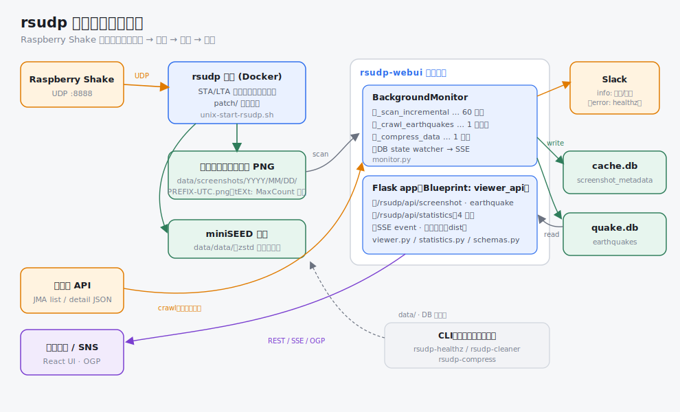
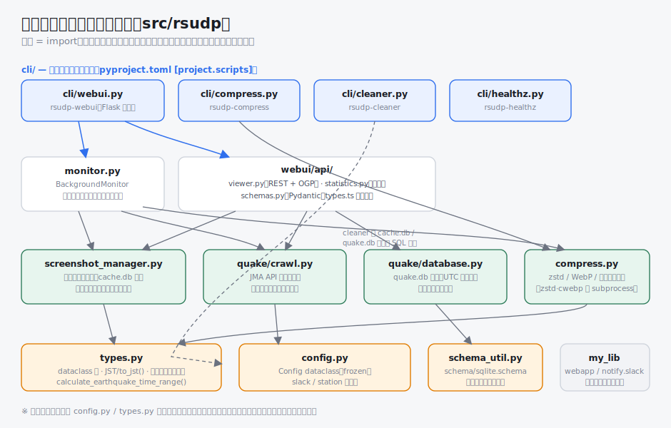
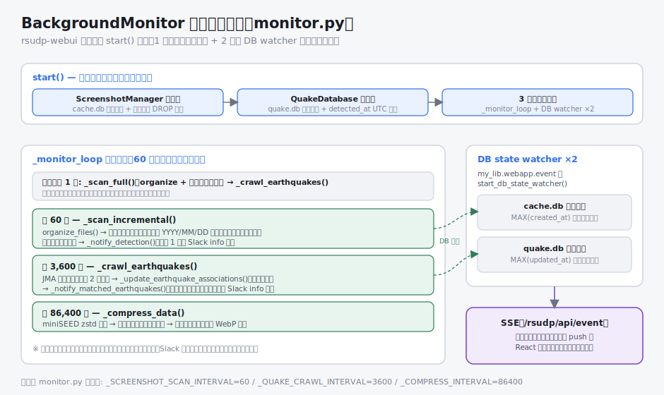
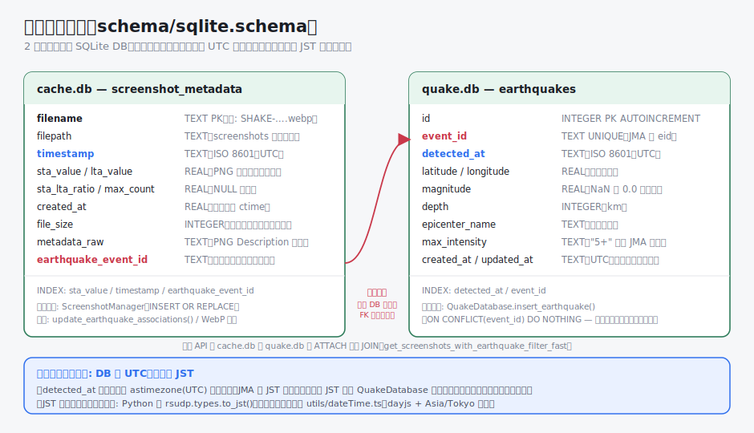
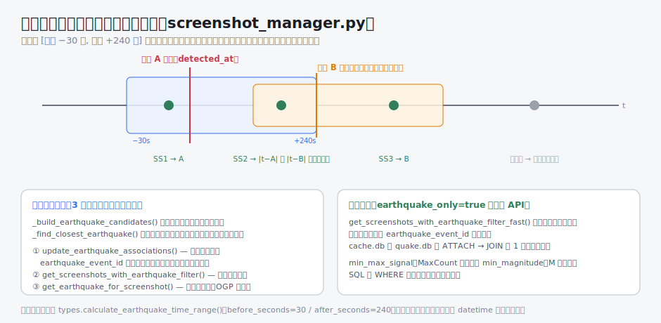
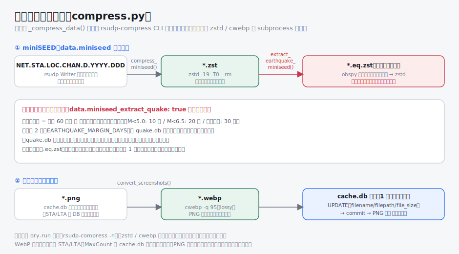
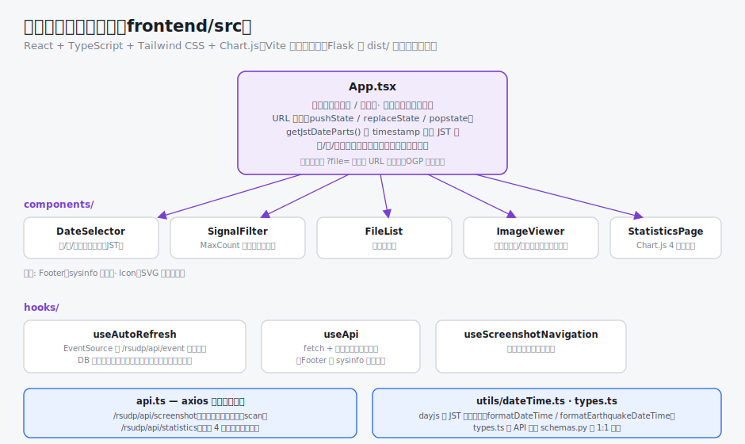

# アーキテクチャ

rsudp Docker 環境のコード構成を、実際のソースコードに基づいて解説します。

- 対象: `src/rsudp`（Python バックエンド）、`frontend/src`（React フロントエンド）、`schema/`
- 関連ドキュメント: [README.md](../README.md)（セットアップ・使い方）、[CLAUDE.md](../CLAUDE.md)（開発規約）

## 全体像



システムは大きく 3 つの実行主体で構成されます。

| 実行主体 | 役割 | 実装 |
| --- | --- | --- |
| rsudp 本体 | Raspberry Shake から UDP でデータを受信し、STA/LTA 検出・波形プロット・スクリーンショット保存・miniSEED 書き出しを行う | 上流の [rsudp](https://github.com/raspishake/rsudp) に `patch/` の diff を適用したもの |
| rsudp-webui プロセス | Flask API + React UI の配信と、バックグラウンド監視（スキャン・JMA クロール・圧縮） | `src/rsudp`（本リポジトリの主体） |
| 補助 CLI | ヘルスチェック・クリーナー・圧縮の単発実行 | `src/rsudp/cli/` |

## エントリーポイント

`pyproject.toml` の `[project.scripts]` で 4 つのコマンドを定義しています。

| コマンド | 実装 | 内容 |
| --- | --- | --- |
| `rsudp-webui` | `cli/webui.py` | Flask アプリを構築して起動（デフォルトポート 5000）。起動時に `BackgroundMonitor` を開始 |
| `rsudp-healthz` | `cli/healthz.py` | `/dev/shm/rsudp.liveness` の更新（60 秒間隔想定）を確認する Liveness チェック。失敗時は rsudp ログ末尾を添えて Slack error チャンネルへ通知 |
| `rsudp-cleaner` | `cli/cleaner.py` | 「最大振幅が閾値以上（デフォルト 300,000）かつ前後 10 分以内に M3.0 以上の地震がない」スクリーンショットを削除 |
| `rsudp-compress` | `cli/compress.py` | 圧縮パイプラインの手動実行（`-n` で dry-run、`--extract-quake` で地震区間抽出） |

`rsudp-webui` は `_create_app()` で以下の Blueprint を登録します（URL prefix はすべて `/rsudp`）。

1. `viewer_api`（`webui/api/viewer.py`）— OGP ルートを優先するため最初に登録
2. 静的配信（React ビルド出力 `frontend/dist`）・ルートリダイレクト・sysinfo（`my_lib.webapp`）
3. SSE イベント通知（`my_lib.webapp.event`、エンドポイント `/rsudp/api/event`）

## モジュール構成



```
src/rsudp/
├── cli/                  # エントリーポイント（webui / healthz / cleaner / compress）
├── monitor.py            # BackgroundMonitor（定期スキャン・クロール・圧縮・Slack 通知）
├── screenshot_manager.py # スクリーンショット整理・メタデータキャッシュ・地震照合
├── compress.py           # miniSEED zstd / 地震区間抽出 / スクリーンショット WebP
├── quake/
│   ├── crawl.py          # 気象庁（JMA）API クローラー
│   └── database.py       # quake.db 管理（UTC 正規化・マイグレーション）
├── webui/api/
│   ├── viewer.py         # REST API + OGP 生成
│   ├── statistics.py     # 統計集計（読み取り専用の生 SQL）
│   └── schemas.py        # Pydantic スキーマ（frontend/src/types.ts と対応）
├── config.py             # 設定の dataclass（frozen）と parse
├── types.py              # 共通 dataclass・JST/to_jst()・ファイル名パース・時間窓計算
└── schema_util.py        # schema/sqlite.schema からのテーブル初期化
```

依存は「エントリーポイント → アプリ層（monitor / webui）→ ドメイン層（screenshot_manager / quake / compress）→ 基盤（config / types / schema_util / my_lib）」の一方向です。

## バックグラウンド監視



`BackgroundMonitor.start()`（`monitor.py`）は、まず `ScreenshotManager` と `QuakeDatabase` を同期的に初期化して **DB スキーマの作成とマイグレーションをリクエスト受付前に確定** させてから、スレッドを起動します。

監視ループは 60 秒周期の単一ループで、カウンタにより 3 種類の処理を多重化しています。

| 周期 | 処理 | 内容 |
| --- | --- | --- |
| 起動時 1 回 | `_scan_full()` → `_crawl_earthquakes()` | ファイル整理 + 全件スキャン、JMA クロール |
| 60 秒 | `_scan_incremental()` | 最新キャッシュ日付以降の `YYYY/MM/DD` ディレクトリのみスキャン。新規検出時は代表 1 枚（MaxCount 最大）を Slack info へ通知 |
| 1 時間 | `_crawl_earthquakes()` | JMA クロール（最大震度 2 以上）→ 地震関連付けの事前計算 → 自局照合が取れた新規地震を Slack info へ通知 |
| 1 日 | `_compress_data()` | miniSEED zstd 圧縮 →（設定時）地震区間抽出 → スクリーンショット WebP 変換 |

このほか `my_lib.webapp.event.start_db_state_watcher()` による監視スレッドが cache.db / quake.db の状態変化（`MAX(created_at)` / `MAX(updated_at)`）を検知し、SSE でブラウザへ push します。React 側はこれを受けて一覧を自動リフレッシュします。

各処理は例外を内部で捕捉してログに記録し、ループ自体は止めません。Slack 通知の失敗も監視処理に影響しません。

## データモデルとタイムゾーン



SQLite の 2 つの DB を使います（スキーマは `schema/sqlite.schema` に一元化し、`schema_util.py` で初期化）。

- **cache.db（`screenshot_metadata`）** — スクリーンショットのメタデータキャッシュ。ファイル名パース結果の `timestamp`（UTC）、PNG メタデータ由来の STA/LTA/MaxCount、事前計算した `earthquake_event_id` を持つ
- **quake.db（`earthquakes`）** — JMA から取得した地震情報。`event_id` は JMA の eid で UNIQUE

2 つの DB は別ファイルのため外部キーは張れず、`earthquake_event_id` → `event_id` は論理参照です。一覧 API では cache.db に quake.db を `ATTACH` して JOIN します。

### タイムゾーン規約

**「DB・ファイル名は UTC、表示は JST」** に統一されています。

- スクリーンショットのファイル名（`PREFIX-YYYY-MM-DD-HHMMSS.png`）は UTC。`types.parse_filename()` が UTC の aware datetime として解釈
- `detected_at` は JMA の JST 表記を挿入時に `astimezone(UTC)` で正規化して保存
- JST への変換は表示層のみ: Python は `rsudp.types.to_jst()`、フロントエンドは `utils/dateTime.ts`（dayjs + `Asia/Tokyo` 固定）
- 比較は必ずタイムゾーン付き datetime 同士で行う（文字列比較はしない）

旧形式のデータ（JST 保存の `detected_at`、UTC 由来の日付列 `year`〜`second`）は、それぞれ `QuakeDatabase` / `ScreenshotManager` の初期化時に走る **冪等マイグレーション** で自動移行されます。

## 地震照合



スクリーンショットと地震の照合は「発生時刻の −30 秒〜+240 秒の時間窓に入り、かつ発生時刻が最も近い地震」を選びます（`types.calculate_earthquake_time_range()`）。

照合ロジックは `screenshot_manager.py` の `_build_earthquake_candidates()` / `_find_closest_earthquake()` に集約され、以下の 3 経路すべてが同じ実装を共有します。

1. `update_earthquake_associations()` — 毎時のクロール後に全件照合し、結果を `earthquake_event_id` 列へ事前計算
2. `get_screenshots_with_earthquake_filter()` — その場で照合する低速パス
3. `get_earthquake_for_screenshot()` — 単一画像用（OGP 生成など）

一覧 API の `earthquake_only=true` は事前計算済みの `earthquake_event_id` を使う高速パス（`get_screenshots_with_earthquake_filter_fast()`）で、`ATTACH` + JOIN の 1 クエリで取得します。

## Web API

Blueprint `viewer_api`（`webui/api/viewer.py`、URL prefix `/rsudp`）。エンドポイント一覧は [README.md](../README.md#api-エンドポイント) を参照してください。実装上の要点:

- **クエリ検証** — `flask_pydantic` の `@validate()` と `schemas.py` の Pydantic モデルでクエリパラメータを検証。レスポンス用スキーマは `frontend/src/types.ts` の TypeScript 型と対応し、`tests/test_api_schema_consistency.py` が両者の整合を検証する
- **画像配信**（`/api/screenshot/image/<filename>`）— ① スクリーンショットディレクトリ直下 → ② ファイル名の日付から組み立てた `YYYY/MM/DD/` サブディレクトリ → ③ 最終フォールバックの `rglob` の順で解決し、全段で `resolve()` 後の実パスがディレクトリ配下に収まることを検証（パストラバーサル対策）
- **OGP 対応** — `/?file=<filename>` へのアクセス時、`index.html` に地震情報つきの OGP メタタグを注入。`/api/screenshot/ogp/<filename>` が SNS プレビュー用のクロップ画像を返す
- **統計 API**（`/api/statistics/daily・distribution・association・sensitivity`）— 集計は `statistics.py` に分離。cache.db / quake.db を読み取り専用の生 SQL で参照し、存在しない DB・テーブルは空データとして扱う。`sensitivity` は `config.station`（観測局座標）設定時のみ、地震ごとの時間窓内 MaxCount 最大値と震央距離（haversine）を点データとして返す

## 圧縮パイプライン



`compress.py` はディスク使用量削減のため 3 種類の処理を提供します（外部バイナリ `zstd` / `cwebp` を subprocess で使用、未導入ならスキップ）。

1. **miniSEED zstd 圧縮** — 過去日の `NET.STA.LOC.CHAN.D.YYYY.DDD` を `zstd -19 -T0 --rm` で可逆圧縮
2. **地震区間抽出**（`data.miniseed_extract_quake: true` のときのみ）— zstd 済みの全日データから quake.db の各地震の前後区間（前 60 秒、後はマグニチュード依存で 10〜30 分）だけを obspy で切り出し `.eq.zst` として保存。**不可逆** のため、直近 2 日の確定待ち・quake.db 最古の地震より前の日は保持、といった安全条件を持つ
3. **スクリーンショット WebP 変換** — cache.db 登録済みの PNG を `cwebp -q 95` で変換し、DB の `filename`/`filepath`/`file_size` を更新。「UPDATE → commit → PNG 削除」の順序を 1 ファイル単位で守り、異常終了時の不整合を防ぐ。STA/LTA 等のメタデータは DB に保存済みのため WebP 化後も参照できる

## フロントエンド



React + TypeScript + Tailwind CSS + Chart.js。Vite でビルドし、`frontend/dist` を Flask が静的配信します（開発時は Vite の dev サーバーが `/rsudp/api` をバックエンドへプロキシ）。

- **App.tsx** — 「一覧 / 統計」タブ、フィルタ状態（MaxCount 閾値・地震のみ・最小マグニチュード・日付）、URL 同期（`pushState`/`replaceState`/`popstate`）を管理。日付の年/月/日分類は `getJstDateParts()` で `timestamp` から **クライアント側で JST 基準** に導出する（サーバーに日付 API はない）
- **useAutoRefresh** — `EventSource` で `/rsudp/api/event`（SSE)を購読し、DB 更新イベントで再フェッチ。切断時は自動再接続
- **api.ts** — axios クライアント。`/rsudp/api/screenshot`（一覧・最新・統計・scan）と `/rsudp/api/statistics`（4 種）
- **StatisticsPage** — 日別検出数・MaxCount 分布・JMA 照合率・検出感度（震央距離 × MaxCount 散布図）を Chart.js で描画
- **types.ts** — API レスポンス型。バックエンドの `schemas.py` と 1:1 対応

## テスト

```
tests/
├── unit/                          # モジュール単位のテスト
├── integration/                   # Flask アプリを起動しての統合テスト
├── test_api_schema_consistency.py # Pydantic スキーマ ⇄ types.ts の整合検証
└── helpers.py                     # テストデータ挿入の共通ヘルパー
```

DB マイグレーション（`detected_at` の UTC 正規化、日付列の DROP）には旧スキーマを再現した専用テストがあり、冪等性も検証しています。
